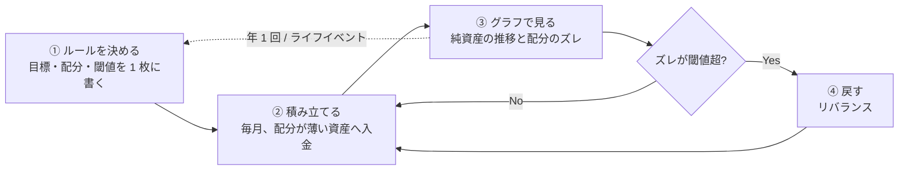

# 資産形成サイクル(要点版)

更新日: 2026-09-18
本質: **ルールを一度決め、月次で積み立て、閾値を超えたときだけ直し、年 1 回だけ見直す。** 情報とグラフはこの 4 動作を支えるためだけに使う。

## 変更点サマリ

- 初版(2026-09-17)の情報源表・比較表・5 層図を、1 つの閉ループと 3 つのリズムに圧縮。
- 出典は各結論の根拠になるものだけに絞った。
- 参照 X 投稿(@beku_AI、2026-09-16)は引き続き未確認。

---

## 1. サイクル図

国内外のどの手法も、この形に集約される。国内(金融庁・J-FLEC)は①②の「長期・積立・分散」と家計管理、海外(Vanguard・Bogleheads・CFP)は③④の「閾値と年次レビュー」を定量化している。

## 2. 3 つのリズム

| リズム | やること | 見るグラフ | 判断 |
| --- | --- | --- | --- |
| 毎月 | 給与から自動積立。入金は目標比率より薄い資産へ | 純資産推移(折れ線)、貯蓄率 | 判断しない(記録のみ) |
| 四半期 | 配分のズレを確認 | 資産別の目標比率との差(棒) | 差が 5% 超なら戻す。株式全体で 9% 超なら即時 |
| 年 1 回 | 目標・配分・制度を点検 | 到達度 = 資産 × 取り崩し率 ÷ 年間支出 | 数字が 1.0 に近づいているか。ルール改訂はこの場だけ |

ライフイベント(結婚・出産・転職・相続・退職)は年次点検を臨時に前倒しする。

## 3. 守るルール(5 つ)

1. 日々の値動きやニュースで売買しない。
2. リバランスは閾値超過時のみ。まず入金と分配金で調整し、売却は最後。
3. 低コストのインデックス投信を中心に、分散を崩さない。
4. 目標配分・取り崩し率・ゴールを変えるのは年次点検かライフイベント時だけ。
5. AI は取得・整形・グラフ化・アラートまで。売買の実行とルール変更は人が行う。

## 4. 数字の根拠

| 数字 | 出典 |
| --- | --- |
| リバランス閾値 5%、年 1〜2 回の監視 | Vanguard, Best practices for portfolio rebalancing(AAII 紹介記事) https://www.aaii.com/journal/article/best-practices-for-portfolio-rebalancing |
| 資産別 ±5〜6%、株式/債券全体 ±9% の許容幅 | GPIF 第 5 期基本ポートフォリオ(2025-04〜) https://www.gpif.go.jp/gpif/15324685gpif/5th_policy_asset_mix_details_jp.pdf |
| 取り崩し率 3.5〜4.7%(Morningstar 3.9%、Bengen 4.7%、Vanguard 3.5〜4.5%) | The Poor Swiss, Updated Trinity Study 2026 https://thepoorswiss.com/updated-trinity-study/ |
| 長期・積立・分散、家計管理 | 金融庁 NISA 特設「資産形成の基本」 https://www.fsa.go.jp/policy/nisa2/invest/ |
| 年 1 回+ライフイベント時のレビュー | CFP Board 7 ステップ(Kitces 解説) https://www.kitces.com/blog/definition-financial-planning-practice-standards-conduct-required-cfp-board/ |
| 低コスト・分散・Stay the course | Bogleheads investment philosophy https://www.bogleheads.org/wiki/Bogleheads%C2%AE_investment_philosophy |
| AI は判断支援に限定、過信と詐欺リスク | 第一ライフ資産運用経済研究所(柏村祐) https://www.dlri.co.jp/report/ld/592997.html |

## 5. 未確認事項

- 参照 X 投稿 https://x.com/beku_ai/status/2100079333952086211 は本環境から取得不可(投稿日時 2026-09-16 13:28 JST)。本文提供後に統合する。
- 上記出典のうち金融庁・GPIF・Bogleheads は直接閲覧できず、検索結果の要約で数値を確認した。
